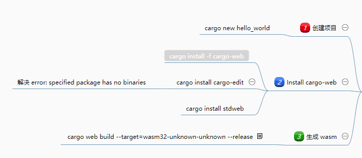

# miniprogram-rust-wasm

Rust + Webassembly 开发微信小程序

# 环境依赖
## rust
安装 rust 
    https://doc.rust-lang.org/cargo/getting-started/installation.html
## node
 安装node环境
 
## 编译

cd stdwebdemo
./build.cmd

正确执行后将在根目录 miniprogram/workers 下生成 js和wasm文件；小程序中引入对应js文件即可使用；
````angular2html
var Rust = require("workers/stdwebdemo.js");

    Rust.then(function (demo) {
      let name = "Rust";
      console.log('demo',demo,demo.add(1,1));
    });
````

## 编译可能出现的问题，请参考下方图片


## 以下是我学习 Webassembly 时趟的坑，主要是 rust 方面，希望帮助你

http://naotu.baidu.com/file/801c1ea6af601052c77284fee2c5480c?token=5a2cd34fc4bb5de3

